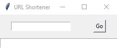

# URL Shortener

  URL shortener made with PyShorteners and Tkinter

## Table of Contents

* [General Info](#general-information)
* [Screenshots](#screenshots)
* [Technologies Used](#technologies-used)
* [Setup](#setup)
* [Project Status](#project-status)
* [Contact](#contact)

## General Information

  URL shortertener made with Pyshorteners and Tkinter. Input links, program outputs shorter links with tinyurl

## Screenshots

## Technologies Used

* Python 3.10.0
* Tkinter
* PyShorteners

## Setup

`pip install tk`
`pip install pyshorteners`

## Project Status

Project is: _completed_

## Contact

[Check out my GitHub](https://github.com/ethan-pt)

[Send me an Email](mailto:tubbeethan@gmail.com)
